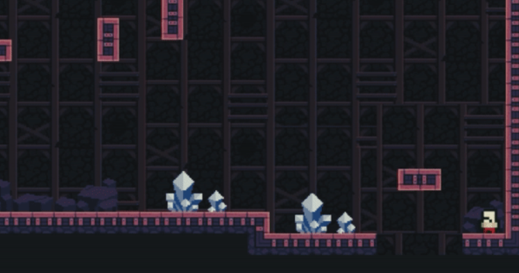

<h1 > Down The Castle - 2D RPG </h1>
<h2> AUTHOR: LE THIEN AN TRAN </h2>

 

<h3> ABOUT IT </h3> 

A 2D Platform RPG about a hero need to protect and save the castle. The monsters are trying to get out of the ground through the castle where the king is living. The hero is forced to go down to the underground every night in order to protect the castle. For every monster killed, the hero will get an item to exchange with the king for rewards. Bosses that requires different attributes will randomly appear each 5 floor. BE PREPARED FOR THAT! 

<h3> GAME FEATURES </h3> 
<ul>
<li> Trading for rewards </li>
<li> Killing and farming </li> 
<li> Bosses </li> 
<li> House decorating </li> 
<li> Level, Stats and Attributes </li>
<li> Variety of items: weapons, armors, helmet, accessories and buff </li> 
</ul>
<h3> UPDATES/COMING SOON </h3>

Since the game is still in progress of its first developing, so I will update it here for more information. 
However, you can still find and get my notification about the game and other games I made on my Instagram @wildemakegames (https://www.instagram.com/wildemakegames/) 

<h3> TOOLS </h3>
<ul>
<li> Unity Game Engine </li>
<li> Visual Studio 2022 </li> 
</ul>
<h3> CURRENT GAME VISUAL </h3>

